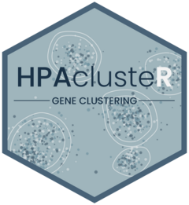

# HPAclusteR 

<!-- badges: start -->
[](https://github.com/buenoalvezm/HPAclusteR/actions/workflows/R-CMD-check.yaml)
[](https://github.com/buenoalvezm/HPAclusteR) 
[](https://github.com/buenoalvezm/HPAclusteR/blob/master/LICENSE.md)
<!-- badges: end -->

`HPAclusteR` is an R package developed by the **Human Protein Atlas** to perform **gene clustering** from transcriptomics data. The package provides a complete pipeline for clustering genes, visualizing clustering results, and annotating gene clusters with functional databases such as **Gene Ontology** and others. It is designed to facilitate the analysis of transcriptomics data and help researchers identify biologically meaningful gene clusters.

>Note: This package is built to work with `AnnDatR` objects, which are designed to handle transcriptomics data efficiently. The package that conceptualizes this data structure can be found [here](https://github.com/emiliosk/AnnDatR).

## Features

- **Gene Clustering Pipeline**:
  - Perform PCA for dimensionality reduction.
  - Calculate distances between genes.
  - Construct Shared Nearest Neighbor (SNN) graphs.
  - Perform consensus clustering to identify robust gene clusters.
  - Generate UMAP embeddings for visualization.
  - Create UMAP cluster hulls to highlight cluster boundaries.

- **Visualization Functions**:
  - Ready-to-use functions for visualizing clustering results, UMAP embeddings, and cluster hulls.

- **Cluster Annotation**:
  - Annotate gene clusters with functional databases such as:
    - **Gene Ontology (GO)**
    - **Reactome Pathways**
    - Other user-defined databases.

## Installation

You can install the development version of `HPAclusteR` from GitHub:

```r
# Install devtools if not already installed
install.packages("devtools")

# Install HPAclusteR
devtools::install_github("buenoalvezm/HPAclusteR")
```

## Usage

### 1. Pipeline for Gene Clustering
The main pipeline for clustering genes involves the following steps:

```r
library(HPAclusteR)

# Example input: AnnDatR object with transcriptomics data
adata_res <- hc_pca(example_adata, components = 40)          # Perform PCA
adata_res <- hc_distance(adata_res, components = 20)         # Calculate distances
adata_res <- hc_snn(adata_res, neighbors = 15)               # Construct SNN graph
adata_res <- hc_consensus_cluster(adata_res, resolution = 6.3) # Perform consensus clustering
adata_res <- hc_umap(adata_res)                              # Generate UMAP embeddings
adata_res <- hc_cluster_hulls(adata_res)                     # Create UMAP cluster hulls
```

### 2. Visualization
`HPAclusteR` provides several functions to visualize clustering results, including UMAP embeddings, cluster hulls, and more.

### 3. Cluster Annotation
Annotate gene clusters with functional databases such as **Gene Ontology**.

## Issues and Support

If you encounter any bugs or you want to recommend new features and changes to existing ones, please open a [new issue](https://github.com/buenoalvezm/HPAclusteR/issues) on our GitHub repository.

## Contact

For any questions or further information, please contact us at [k.antono@outlook.com](mailto:k.antono@outlook.com).
