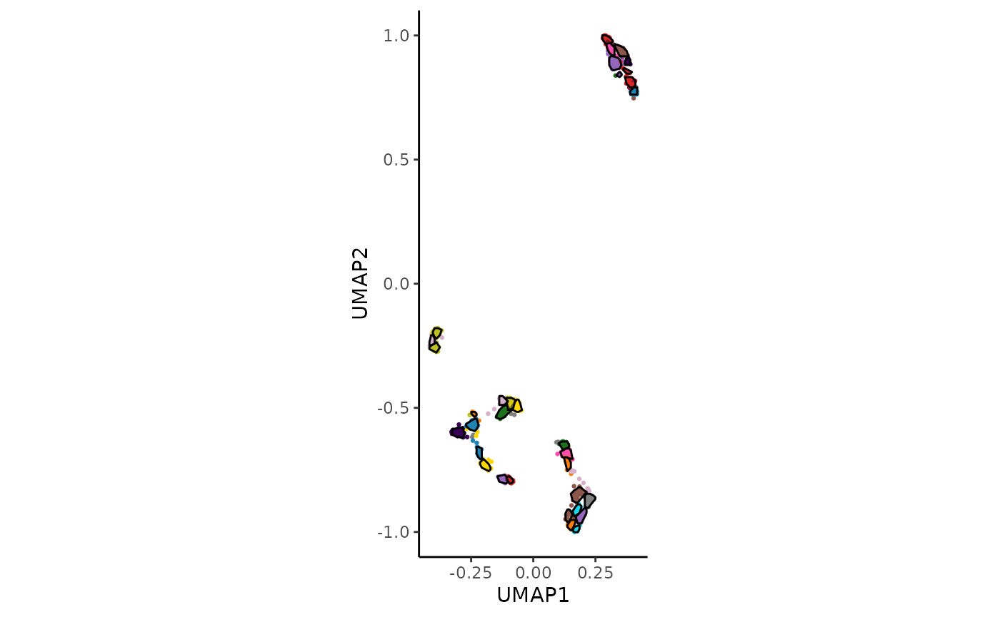
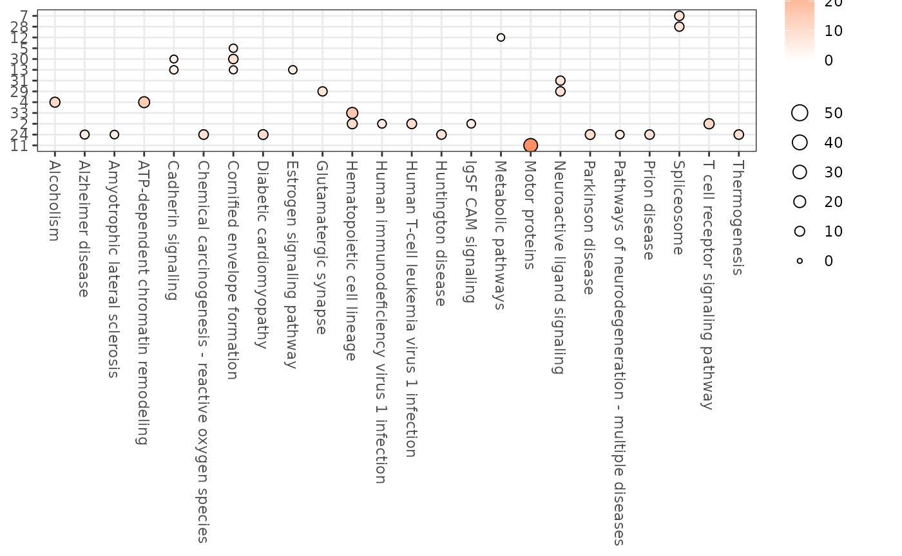
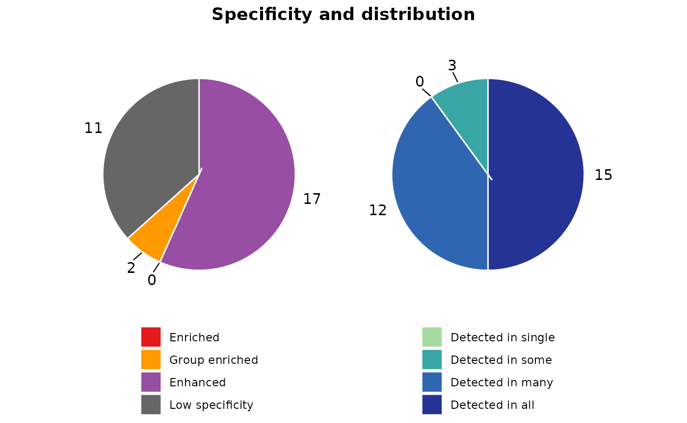
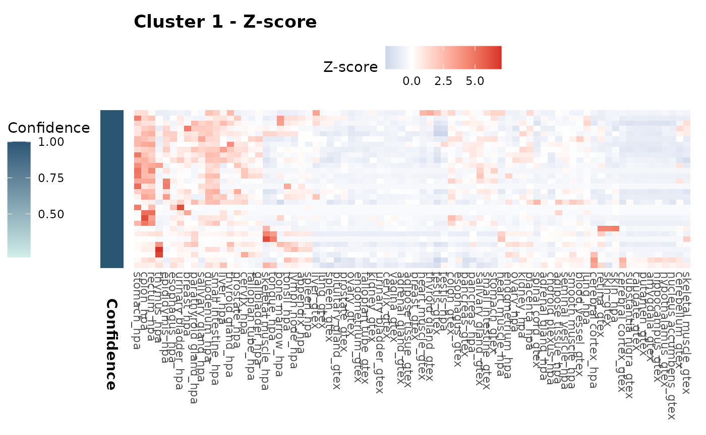
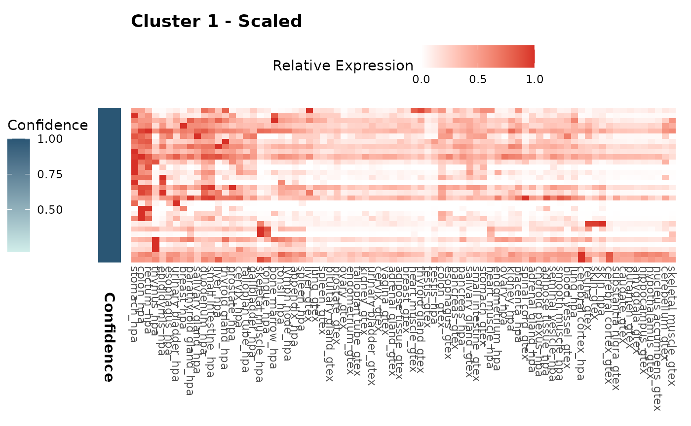
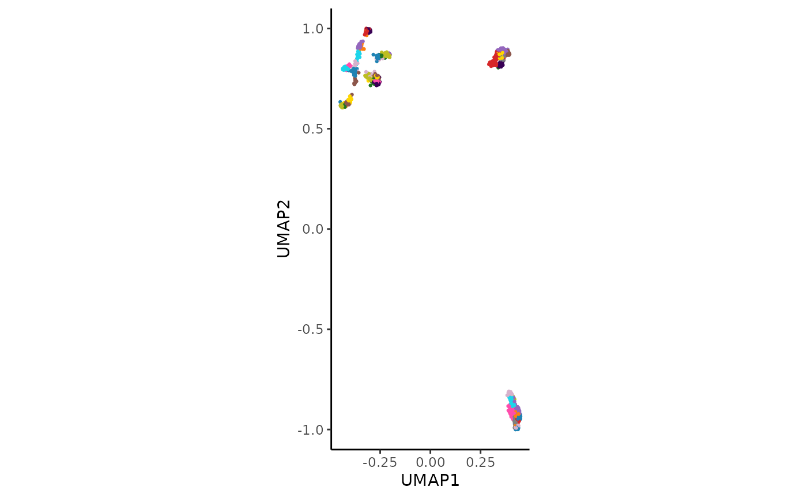
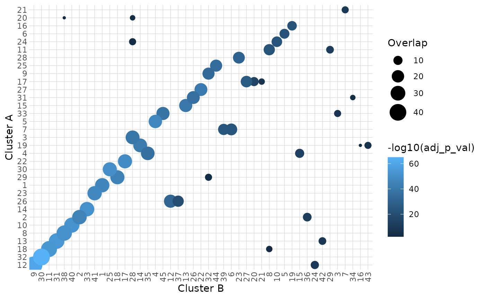
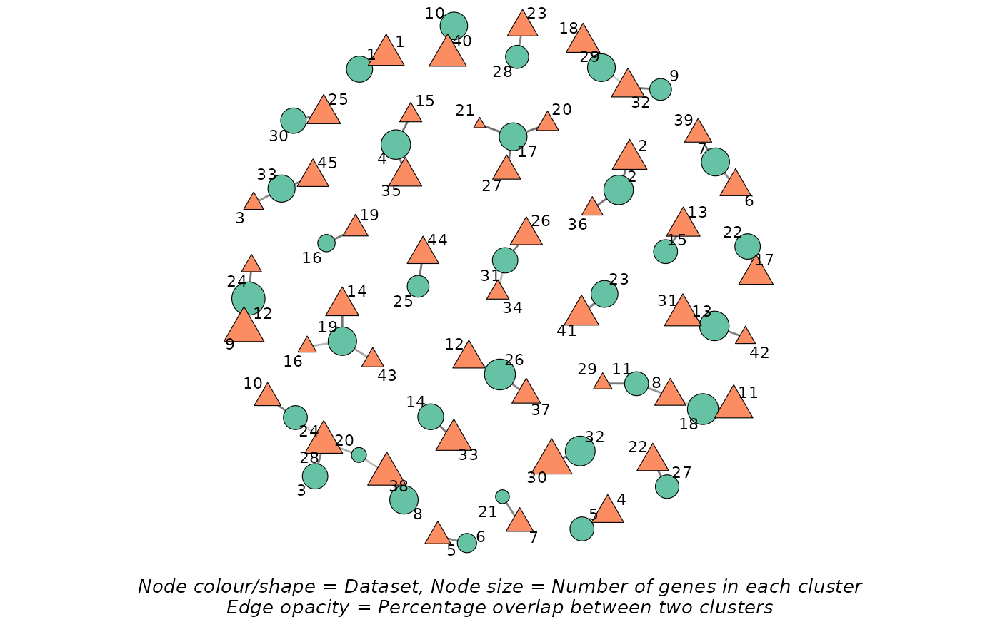

# HPAclusteR

## Introduction

`HPAclusteR` is an R package designed by the Human Protein Atlas to
streamline the process of gene clustering from transcriptomics data. It
provides a modular pipeline for performing PCA, calculating distances,
constructing shared nearest neighbor (SNN) graphs, consensus clustering,
UMAP, functional annotation, and different publication-ready
visualizations. The package is designed to work with [AnnDatR
objects](https://github.com/emiliosk/AnnDatR), making it easy to
integrate into workflows for transcriptomics data analysis.

## Getting Started

To begin, load the `HPAclusteR` package:

``` r

library(HPAclusteR)
```

We will use the built-in `example_adata` dataset for this vignette. This
dataset is a toy example designed to demonstrate the functionality of
the package.

> 💡 HPAclusteR can work with AnnDatR objects created using the AnnDatR
> package, as long as the data is transposed so that genes are the
> observations (rows) and samples are the variables (columns).
> Alternatively, you can use the hc_initialize() function to create a
> properly formatted object directly from your data frames.

## Clustering Pipeline

> 💡 This part demonstrates the step-by-step usage of the `HPAclusteR`
> pipeline. For users who prefer simplicity, the
> [`hc_auto_cluster()`](https://buenoalvezm.github.io/HPAclusteR/reference/hc_auto_cluster.md)
> function can be used to run the entire pipeline in one call.

### Step 1: Principal Component Analysis (PCA)

PCA is the first step in the pipeline, used to reduce the dimensionality
of the data while retaining the most important features.

``` r

adata_res <- hc_pca(example_adata, components = 40)
head(adata_res$obsm$X_pca[, 1:5])  # PCA scores
#>                       PC1       PC2        PC3        PC4        PC5
#> ENSG00000002745  2.525134  1.244945  4.9524275  2.9628522  0.5502585
#> ENSG00000004660 -3.978987  4.237604  1.0125002  2.3806353  0.1701373
#> ENSG00000006047 -3.335958 -5.230821  0.2785071 -0.8539639 -1.0674333
#> ENSG00000006059  0.384914 -1.662885  4.2574866  1.7776202  0.3784697
#> ENSG00000006453  4.327132 -2.237923  2.0932705 -0.3790134 -5.5485171
#> ENSG00000006740 -3.499337  4.827055 -1.0947394 -0.6904189 -3.5299211
head(adata_res$uns$pca$r2cum)      # Cumulative explained variance
#> [1] 0.2353205 0.4247893 0.5235696 0.6031322 0.6678779 0.7212278
```

The PCA step reduces the dimensionality of the data to 40 components,
which can be adjusted based on the dataset and analysis goals.

> 💡 If the expression matrix contains missing values,
> [`hc_pca()`](https://buenoalvezm.github.io/HPAclusteR/reference/hc_pca.md)
> reports how many and, by default, imputes them with their column mean
> so that the fast SVD path is used. Set `na_action = "nipals"` for the
> slower iterative algorithm that handles missing values directly, or
> `na_action = "omit"` to drop the affected genes.

### Step 2: Distance Calculation

Next, we calculate the pairwise distances between samples using the
PCA-reduced data. The
[`hc_distance()`](https://buenoalvezm.github.io/HPAclusteR/reference/hc_distance.md)
function supports multiple distance metrics, such as “euclidean” and
“spearman”. We will use the number of components determined by Kaiser’s
rule.

``` r

adata_res <- hc_distance(
  adata_res,
  components = hc_kaisers_rule(adata_res),
  method = "spearman"
)
head(adata_res$uns$distance)
#> [1] 1.0090909 1.3363636 0.3363636 0.6090909 1.3454545 1.2454545
```

### Step 3: Shared Nearest Neighbor (SNN) Graph Construction

The SNN graph is constructed to identify clusters of similar samples.
This step uses the distance matrix calculated in the previous step.

``` r

adata_res <- hc_snn(adata_res, neighbors = 15, prune = 1 / 15)
adata_res$uns$neighbors$snn[1:5, 1:5]
#> 5 x 5 sparse Matrix of class "dgCMatrix"
#>                 ENSG00000002745 ENSG00000004660 ENSG00000006047 ENSG00000006059
#> ENSG00000002745      1.00000000               .               .      0.07142857
#> ENSG00000004660      .                        1               .      .         
#> ENSG00000006047      .                        .               1      .         
#> ENSG00000006059      0.07142857               .               .      1.00000000
#> ENSG00000006453      .                        .               .      .         
#>                 ENSG00000006453
#> ENSG00000002745               .
#> ENSG00000004660               .
#> ENSG00000006047               .
#> ENSG00000006059               .
#> ENSG00000006453               1
```

The `neighbors` parameter controls the number of nearest neighbors
considered, while `prune` adjusts the sparsity of the graph.

### Step 4: Consensus Clustering

Consensus clustering is performed to identify robust clusters in the
data. This step aggregates clustering results from multiple runs, in
this case 100.

``` r

adata_res <- hc_cluster_consensus(
  adata_res, 
  resolution = 8, 
  method = "louvain",
  n_seeds = 100
)

head(adata_res$obs$cluster)
#> [1] "13" "8"  "14" "13" "27" "8"
```

The `resolution` parameter controls the granularity of the clustering.
Higher values result in more clusters.

### Step 5: UMAP Visualization

UMAP is used to visualize the clusters in a low-dimensional space. This
step provides an intuitive way to explore the clustering results. It
uses the constructed SNN graph.

``` r

adata_res <- hc_umap(adata_res, verbose = FALSE)
head(adata_res$obsm$X_umap)
#>                     UMAP_1     UMAP_2
#> ENSG00000002745 -0.1701197 -0.7438677
#> ENSG00000004660  0.2096964 -0.8561486
#> ENSG00000006047  0.3996527  0.7626277
#> ENSG00000006059 -0.1950597 -0.7427994
#> ENSG00000006453 -0.2141915 -0.6715012
#> ENSG00000006740  0.2142968 -0.8946852
```

### Step 6: Cluster Hulls (Optional)

Cluster hulls are calculated to visualize the boundaries of each cluster
in the UMAP plot.

``` r

adata_res <- hc_cluster_hulls(adata_res, poly_smoothing = 4)
head(adata_res$uns$UMAP_hulls$hulls)
#> # A tibble: 6 × 7
#>   cluster sub_cluster sub_type landmass      X      Y polygon_id
#>   <chr>         <int> <chr>       <int>  <dbl>  <dbl> <chr>     
#> 1 15                1 primary         1 -0.376 -0.256 15_1_1    
#> 2 15                1 primary         1 -0.390 -0.235 15_1_1    
#> 3 15                1 primary         1 -0.411 -0.249 15_1_1    
#> 4 15                1 primary         1 -0.418 -0.256 15_1_1    
#> 5 15                1 primary         1 -0.418 -0.263 15_1_1    
#> 6 15                1 primary         1 -0.404 -0.270 15_1_1
```

### Step 7: Visualization

Finally, we visualize the UMAP plot with clusters and hulls using the
[`hc_plot_umap()`](https://buenoalvezm.github.io/HPAclusteR/reference/hc_plot_umap.md)
function.

``` r

hc_plot_umap(adata_res, plot = "both")
```



The `plot` argument can be set to `"points"`, `"hulls"`, or `"both"` to
customize the visualization.

## Cluster Annotation

In this part we will annotate our clusters using the KEGG database.
Users can use KEGG, GO or even other databases such as the Human Protein
Atlas, Panglao, Trrust and Reactome. Check
[`hc_annotate()`](https://buenoalvezm.github.io/HPAclusteR/reference/hc_annotate.md)
for further details.

``` r

enrichment_res <- hc_annotate(
  adata_res,
  dbs = "KEGG",
  verbose = FALSE
)
#> Warning in clusterProfiler::bitr(unique(clustering_data[["gene"]]), fromType =
#> "ENSEMBL", : 0.82% of input gene IDs are fail to map...
#> Warning in calculate_qvalue(ora_res$pvalue): qvalue::qvalue() failed, returning
#> NA for qvalue. Error: missing values and NaN's not allowed if 'na.rm' is FALSE
#> Warning in calculate_qvalue(ora_res$pvalue): qvalue::qvalue() failed, returning
#> NA for qvalue. Error: missing values and NaN's not allowed if 'na.rm' is FALSE
#> Warning in calculate_qvalue(ora_res$pvalue): qvalue::qvalue() failed, returning
#> NA for qvalue. Error: missing values and NaN's not allowed if 'na.rm' is FALSE
head(enrichment_res$enrichment)
#> # A tibble: 6 × 10
#>   `Cluster ID` Database      `Term ID` Term          GeneRatio BgRatio `P-value`
#>   <chr>        <chr>         <chr>     <chr>         <chr>     <chr>       <dbl>
#> 1 11           KEGG pathways hsa04814  Motor protei… 1/1       11/352    3.12e-2
#> 2 12           KEGG pathways hsa01100  Metabolic pa… 11/21     69/352    5.31e-4
#> 3 13           KEGG pathways hsa04382  Cornified en… 11/24     40/352    9.01e-6
#> 4 13           KEGG pathways hsa04519  Cadherin sig… 8/24      24/352    5.05e-5
#> 5 13           KEGG pathways hsa04915  Estrogen sig… 4/24      12/352    5.74e-3
#> 6 2            KEGG pathways hsa04660  T cell recep… 5/12      13/352    2.03e-5
#> # ℹ 3 more variables: `Adjusted P-value` <dbl>, `Gene IDs` <chr>,
#> #   `Gene names` <chr>
enrichment_res$bubblemap_kegg
```



We can also perform gene classification within each cluster using the
Human Protein Atlas (HPA) logic. This approach assigns specificity and
distribution categories to genes based on their expression patterns
across sample categories (e.g., tissues), providing insights into gene
function and tissue specificity.

``` r

classify_res <- hc_classify(
  adata_res,
  sample_categories = "tissue_name"
)
head(classify_res$classification[["1"]])
#> # A tibble: 6 × 5
#>   ENSG            spec_category   spec_sample_categories   tau dist_category   
#>   <chr>           <chr>           <chr>                  <dbl> <chr>           
#> 1 ENSG00000054219 Enhanced        thymus;lymph node       0.7  Detected in many
#> 2 ENSG00000069974 Enhanced        stomach;bone marrow     0.43 Detected in all 
#> 3 ENSG00000077147 Low specificity NA                      0.28 Detected in all 
#> 4 ENSG00000079385 Enhanced        colon;rectum            0.63 Detected in many
#> 5 ENSG00000081923 Enhanced        colon;rectum;stomach    0.59 Detected in many
#> 6 ENSG00000101972 Low specificity NA                      0.32 Detected in all
classify_res$pie_charts[["1"]]
```



We can visualize the gene expression patterns within each cluster using
heatmaps. Both z-score and scaled expression heatmaps are generated for
each cluster, allowing us to explore and compare gene expression
profiles across different groups. The confidence of each cluster is also
presented in the sidebar.

``` r

expr_heatmaps <- hc_plot_expression(adata_res)
expr_heatmaps$zscore[["1"]]
```



``` r

expr_heatmaps$scaled[["1"]]
```



## Cluster Comparison

Finally, we can compare different clustering results using the
[`hc_cluster_compare()`](https://buenoalvezm.github.io/HPAclusteR/reference/hc_cluster_compare.md)
function. Here, we will create a second clustering result with a
different resolution and compare it to the first result. This time we
will use the
[`hc_auto_cluster()`](https://buenoalvezm.github.io/HPAclusteR/reference/hc_auto_cluster.md)
function for simplicity.

``` r

adata_res2 <- hc_auto_cluster(
  example_adata,
  cluster_resolution = 12,
  verbose = FALSE
)
```



``` r


comparison_res <- hc_cluster_compare(
  adata_res,
  adata_res2,
  graph_type = "bipartite"
)
comparison_res$heatmap
```



``` r

comparison_res$network
```



## Conclusion

Explore the package further to uncover the full potential of your
transcriptomics data!

> 💡 Remember that these data are an example toy-dataset with only a
> sample of the total protein-coding genes. The results in this guide
> should not be interpreted as real results. The purpose of this
> vignette is to show you how to use the package and its functions.

``` r

sessionInfo()
#> R version 4.6.1 (2026-06-24)
#> Platform: x86_64-pc-linux-gnu
#> Running under: Ubuntu 24.04.4 LTS
#> 
#> Matrix products: default
#> BLAS:   /usr/lib/x86_64-linux-gnu/openblas-pthread/libblas.so.3 
#> LAPACK: /usr/lib/x86_64-linux-gnu/openblas-pthread/libopenblasp-r0.3.26.so;  LAPACK version 3.12.0
#> 
#> locale:
#>  [1] LC_CTYPE=C.UTF-8       LC_NUMERIC=C           LC_TIME=C.UTF-8       
#>  [4] LC_COLLATE=C.UTF-8     LC_MONETARY=C.UTF-8    LC_MESSAGES=C.UTF-8   
#>  [7] LC_PAPER=C.UTF-8       LC_NAME=C              LC_ADDRESS=C          
#> [10] LC_TELEPHONE=C         LC_MEASUREMENT=C.UTF-8 LC_IDENTIFICATION=C   
#> 
#> time zone: UTC
#> tzcode source: system (glibc)
#> 
#> attached base packages:
#> [1] stats     graphics  grDevices utils     datasets  methods   base     
#> 
#> other attached packages:
#> [1] HPAclusteR_1.1.0
#> 
#> loaded via a namespace (and not attached):
#>   [1] DBI_1.3.0               gson_0.2.1              httr2_1.3.0            
#>   [4] rlang_1.3.0             magrittr_2.0.5          clue_0.3-68            
#>   [7] DOSE_4.6.0              otel_0.2.0              compiler_4.6.1         
#>  [10] RSQLite_3.53.3          png_0.1-9               systemfonts_1.3.2      
#>  [13] callr_3.8.0             vctrs_0.7.3             reshape2_1.4.5         
#>  [16] stringr_1.6.0           pkgconfig_2.0.3         crayon_1.5.3           
#>  [19] fastmap_1.2.0           XVector_0.52.0          labeling_0.4.3         
#>  [22] utf8_1.2.6              rmarkdown_2.31          enrichplot_1.32.0      
#>  [25] ps_1.9.3                ragg_1.5.2              purrr_1.2.2            
#>  [28] bit_4.6.0               xfun_0.60               cachem_1.1.0           
#>  [31] aplot_0.3.1             jsonlite_2.0.0          blob_1.3.0             
#>  [34] tidydr_0.0.6            tweenr_2.0.3            cluster_2.1.8.2        
#>  [37] parallel_4.6.1          R6_2.6.1                bslib_0.12.0           
#>  [40] stringi_1.8.9           RColorBrewer_1.1-3      enrichit_0.2.1         
#>  [43] jquerylib_0.1.4         GOSemSim_2.38.3         Rcpp_1.1.2             
#>  [46] Seqinfo_1.2.0           knitr_1.51              ggtangle_0.1.2         
#>  [49] IRanges_2.46.0          splines_4.6.1           Matrix_1.7-5           
#>  [52] igraph_2.3.3            aisdk_1.4.12            tidyselect_1.2.1       
#>  [55] qvalue_2.44.0           yaml_2.3.12             processx_3.9.0         
#>  [58] lattice_0.22-9          tibble_3.3.1            plyr_1.8.9             
#>  [61] withr_3.0.3             Biobase_2.72.0          treeio_1.36.1          
#>  [64] KEGGREST_1.52.2         S7_0.2.2                evaluate_1.0.5         
#>  [67] gridGraphics_0.5-1      desc_1.4.3              polyclip_1.10-7        
#>  [70] scatterpie_0.2.6        Biostrings_2.80.1       pillar_1.11.1          
#>  [73] ggtree_4.2.0            stats4_4.6.1            clusterProfiler_4.20.0 
#>  [76] ggfun_0.2.1             generics_0.1.4          S4Vectors_0.50.1       
#>  [79] ggplot2_4.0.3           scales_1.4.0            tidytree_0.4.8         
#>  [82] glue_1.8.1              gdtools_0.5.1           lazyeval_0.2.3         
#>  [85] tools_4.6.1             ggnewscale_0.5.2        RSpectra_0.16-2        
#>  [88] ggiraph_0.9.6           fs_2.1.0                grid_4.6.1             
#>  [91] tidyr_1.3.2             ape_5.8-1               AnnotationDbi_1.74.0   
#>  [94] nlme_3.1-169            patchwork_1.3.2         ggforce_0.5.0          
#>  [97] cli_3.6.6               rappdirs_0.3.4          textshaping_1.0.5      
#> [100] fontBitstreamVera_0.1.1 dplyr_1.2.1             uwot_0.2.4             
#> [103] gtable_0.3.6            yulab.utils_0.2.4       sass_0.4.10            
#> [106] digest_0.6.39           fontquiver_0.2.1        BiocGenerics_0.58.1    
#> [109] ggrepel_0.9.8           ggplotify_0.1.3         org.Hs.eg.db_3.23.1    
#> [112] htmlwidgets_1.6.4       farver_2.1.2            memoise_2.0.1          
#> [115] htmltools_0.5.9         pkgdown_2.2.1           lifecycle_1.0.5        
#> [118] httr_1.4.8              GO.db_3.23.1            fontLiberation_0.1.0   
#> [121] bit64_4.8.2             MASS_7.3-65
```
